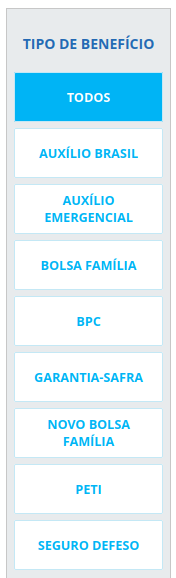
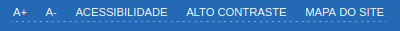
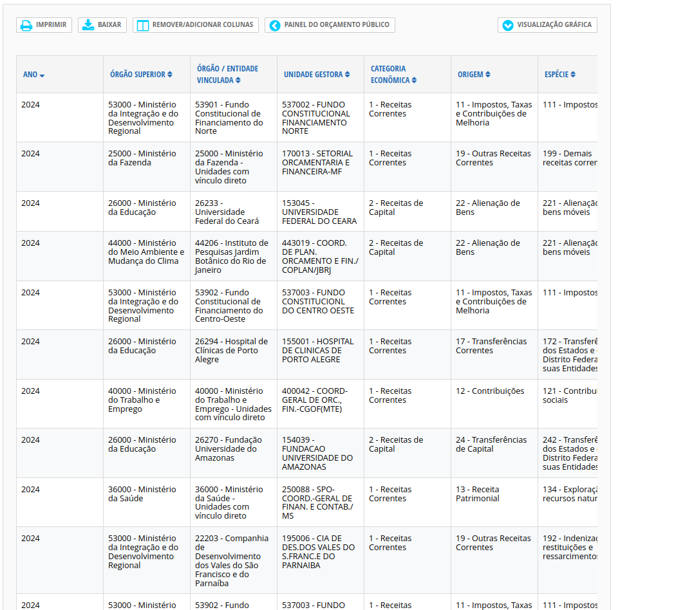
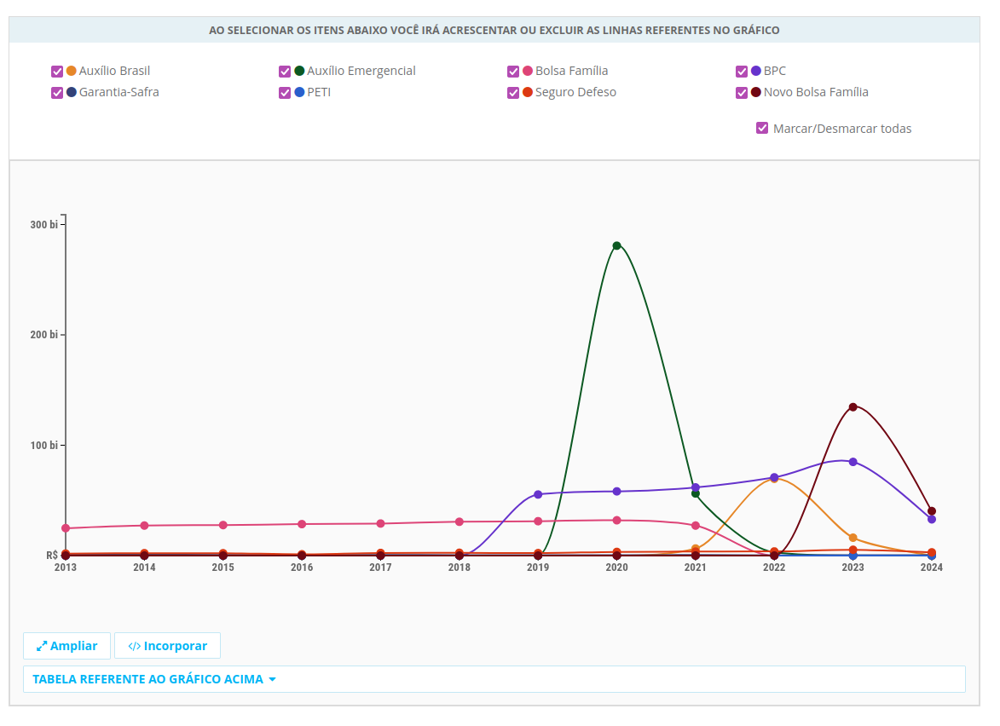

# Guia de Acessibilidade Digital

Este é um guia de acessibilidade digital desenvolvido no primeiro semestre de 2024 como parte de um trabalho da disciplina de IHC.
Todo o conteúdo disponível aqui possui instruções de como desenvolver produtos de software que possam ser acessíveis para o público geral.
Dentro desse Guia será analisado os contúdos do site [Portal da Transparência](https://portaldatransparencia.gov.br/).

# Sumário

- [Guia de Acessibilidade Digital](#guia-de-acessibilidade-digital)
- [Sumário](#sumário)
- [Orientações de Acessibilidade](#orientações-de-acessibilidade)
   * [Deficiência Visual](#deficiência-visual)
   * [Deficiência Física](#deficiência-física)
   * [Deficiência Auditiva](#deficiência-auditiva)
   * [Deficiência de Fala](#deficiência-de-fala)
   * [Neurodivergentes](#neurodivergentes)
   * [Limitações Relacionadas à Idade](#limitações-relacionadas-à-idade)
- [Padrões de codificação](#padrões-de-codificação)
   * [Utilizar arquivos externos para as Folhas de estilo (CSS) e Javascript](#utilizar-arquivos-externos-para-as-folhas-de-estilo-css-e-javascript)
   * [Limitar as requisições HTTP](#limitar-as-requisições-http)
   * [Evitar o uso de popups](#evitar-o-uso-de-popups)
   * [Utilizar URL's amigáveis](#utilizar-urls-amigáveis)
   * [Header](#header)
      + [Declarar o doctype correto da página](#declarar-o-doctype-correto-da-página)
      + [Declarar o idioma utilizado](#declarar-o-idioma-utilizado)
      + [Colocar um título relevante e presente em todas as páginas](#colocar-um-título-relevante-e-presente-em-todas-as-páginas)
   * [Descrever a codificação de caracteres da página](#descrever-a-codificação-de-caracteres-da-página)
   * [Body (Corpo)](#body-corpo)
      + [Utilize os elementos corretos para a marcação do código.](#utilize-os-elementos-corretos-para-a-marcação-do-código)
      + [Inserir apenas um elemento h1 na página](#inserir-apenas-um-elemento-h1-na-página)
      + [Marcar listas de itens e objetos de forma adequada.](#marcar-listas-de-itens-e-objetos-de-forma-adequada)
      + [Verificar se as tabelas estão sendo utilizadas da forma correta](#verificar-se-as-tabelas-estão-sendo-utilizadas-da-forma-correta)
   * [CSS (Folhas de Estilo)](#css-folhas-de-estilo)
      + [A folha de estilos deve ser externa](#a-folha-de-estilos-deve-ser-externa)
      + [Verificar se a página é compreendida e usável quando o CSS está 'off'](#verificar-se-a-página-é-compreendida-e-usável-quando-o-css-está-off)

# Orientações de Acessibilidade

## Deficiência Visual

De modo geral, o site não apresenta uma acessibilidade adequada para deficientes visuais. Observa-se um contraste insuficiente entre o texto e o plano de fundo (Figura 1), o que compromete a legibilidade. Embora o site possua um modo de contraste (Figura 2), o botão para ativar essa funcionalidade está mal posicionado e, devido à sua falta de contraste, é difícil de ser percebido por daltônicos e por indivíduos com dificuldades em detectar contraste de cores. Além disso, o botão para ativar o modo de contraste está localizado de forma pouco intuitiva, e o texto do botão apresenta um contraste inadequado com a página (Figura 2).

O site permite a alteração do tamanho da fonte, o que beneficia pessoas com problemas de visão como miopia, astigmatismo e hipertrofia (Figura 2). Entretanto, não há descrições de imagens disponíveis, o que dificulta significativamente a navegação para deficientes visuais (Figura 3). Adicionalmente, pessoas cegas enfrentariam ainda mais dificuldades, uma vez que o site não oferece recursos de leitura automática de textos nem navegação por comandos de voz.

**Figura 1**


**Figura 2**


**Figura 3**


**Figura 4**


## Deficiência Física

O site apresenta barreiras significativas para pessoas com deficiência física. A navegação exige o uso de links pequenos (Figura 5), o que pode ser estressante e desafiador para indivíduos com tremores, movimentos involuntários ou dores que limitam os movimentos. Em casos mais graves, a ausência de uma ferramenta de acesso que não exija a interação com botões torna o site inavegável para pessoas com paralisia, dores severas ou ausência de membros.

**Figura 5**


## Deficiência Auditiva

O site não utiliza meios auditivos para realizar ações, garantindo que nenhum deficiente auditivo seja prejudicado ao utilizá-lo.

## Deficiência de Fala

O site não requer o uso da fala para nenhuma ação, garantindo que nenhum usuário com deficiência de fala seja prejudicado ao utilizá-lo.

## Neurodivergentes

O site não possui cores agressivas que poderiam assustar ou afastar pessoas neurodivergentes, apresentando um ambiente acolhedor para a maioria das neurodivergências visuais. Além disso, o site não utiliza recursos auditivos ou de fala, evitando problemas relacionados. A interface é fácil de entender, com gráficos coloridos (Figura 6) e interativos e vídeos explicativos. O único ponto negativo são as tabelas detalhadas, que podem ser pouco atrativas para pessoas neurodivergentes(Figura 7).

**Figura 6**


**Figura 7**


## Limitações Relacionadas à Idade

Pessoas idosas podem utilizar o site com relativa facilidade, embora possam enfrentar dificuldades em clicar nos botões caso sofram de deterioração física (Figura 5). Outro problema potencial é a cegueira causada por problemas de saúde, o que tornaria a utilização do site praticamente impossível para esses usuários.

# Padrões de codificação

## Utilizar arquivos externos para as Folhas de estilo (CSS) e Javascript

Exemplo:

```html
<link rel="stylesheet" type="text/css" media="screen" href="style.css" />
```

## Limitar as requisições HTTP

Muitas requisições HTTP reduzem o desempenho do navegador

## Evitar o uso de popups

Pop-ups são janelas de diversos tamanhos que abrem com avisos e publicidade. Esse recurso deve ser evitado a todo o custo em sítios governamentais.

Alguns motivos para o não uso de pop-ups:

- Os navegadores mais modernos bloqueiam pop-ups. Sendo assim, se algum informe importante é dado pelo pop-up ele não é visto.
- Pop-ups não são acessíveis. Usuários que usam programas leitores de tela podem se perder, sem saber onde estão ou se realmente entraram no sitio pretendido.
- Alguns pop-ups mais modernos costumam burlar o sistema anti-pop-up dos navegadores carregando na própria página, atrapalhando a leitura do onteúdo.
- Informações importantes devem sempre estar em destaque dentro da página. Na diagramação reserve um espaço para os destaques, que pode ser desativado caso não esteja sendo usado. Nunca use pop-ups para avisos importantes, como recadastro de usuários ou para carregar aplicações ou novas instâncias da página.

## Utilizar URL's amigáveis

Cada página de um sítio deve ser identificada com sua URL única e compreensível.

```
Certo: http://www.portal.gov.br/contato

Errado: http://www.portal.gov.br/default.php?reg=2&p_secao=18
```

## Header

### Declarar o doctype correto da página

Todo documento HTML e XHTML deve declarar o doctype correto para ser considerado válido. O doctype informa ao navegador o tipo de documento que deve ser usado ao carregar a página. É também por meio da declaração de doctype que as ferramentas de validação analisam o código da página e indicam correções.

Existem três tipos:

- Frameset
- Strict
- Transational

### Declarar o idioma utilizado

Exemplo:

```html
<html lang="pt-br">
```

Além de declarar o idioma é possível declarar o país-alvo e a localização da página:

```html
<meta name="country" content="Brazil" />
```

### Colocar um título relevante e presente em todas as páginas

O título de uma página é o enunciado entre as tags "title" "/title" e deve ser um dos elementos obrigatórios do cabeçalho. É importante que o título esteja de acordo com o conteúdo. O título define o rótulo padrão dos favoritos e é a chamada na listagem dos motores de busca. Recomenda-se:

- Evitar expressões redundantes como "bem-vindo ao sítio do ministério x" ou "sítio do ministério x", "página", "homepage", entre outros;
- Não utilize qualquer tipo de slogan no início do título, caso necessário, utilize após o nome do órgão ou projeto separado por hífen. Ex: `<title>`Projeto XYZ - Mais desenvolvimento e cidadania `</title>`;
- Evite o emprego de siglas de instituições ou de seus departamentos, projetos ou programas.
- Utilizar, de preferência, o assunto da página seguido pelo nome do órgão separado por hífen. Ex: `<title>`Contato - Ministério do Planejamento Orçamento e Gestão `</title>`;
- O título deve ter no máximo 60 caracteres;
- Não "polua" o título com palavras-chaves. A inserção de palavras-chaves antes ou após o título principal da página pode confundir os usuários que utilizam leitores de tela. Utilize as tags meta para palavras-chave.

## Descrever a codificação de caracteres da página

Exemplo:

```http
Content-Type: text/html; charset=utf-8
```

## Body (Corpo)

### Utilize os elementos corretos para a marcação do código.

Errado:

```html
<div id="main">
    <p class="titulosec">O subtítulo</p>
</div>
```

Correto:

```html
<div id="main">
    <h2>O subtítulo</h2>
</div>
```

### Inserir apenas um elemento h1 na página

Toda página deve possuir um e apenas um elemento H1. O conteúdo do cabeçalho deve guardar semelhança com o conteúdo do elemento TITLE do cabeçalho.

### Marcar listas de itens e objetos de forma adequada.

Escolher o tipo de lista de acordo com o tipo de item que se deseja inserir. Qual dos tipos abaixos o dado melhor se encaixa?

- Lista ordenada
- Lista não-ordenada
- Lista de definição

### Verificar se as tabelas estão sendo utilizadas da forma correta

Para tornar os dados das tabelas acessíveis é importante utilizar os diversos componentes disponíveis como o cabeçalho `<th>` e o atributo de sumário.

## CSS (Folhas de Estilo)

### A folha de estilos deve ser externa

A folha de estilos (CSS) deve estar sempre em um ou mais arquivos à parte do código, mantendo a separação entre estrutura e apresentação.

### Verificar se a página é compreendida e usável quando o CSS está 'off'

Alguns recursos como o uso de imagens no lugar de texto, ou de menus dinâmicos, podem incorrer na perda de acessibilidade e compreensão quando o CSS é desabilitado. Assegure-se que a página é compreensível e usável com o CSS desabilitado.
