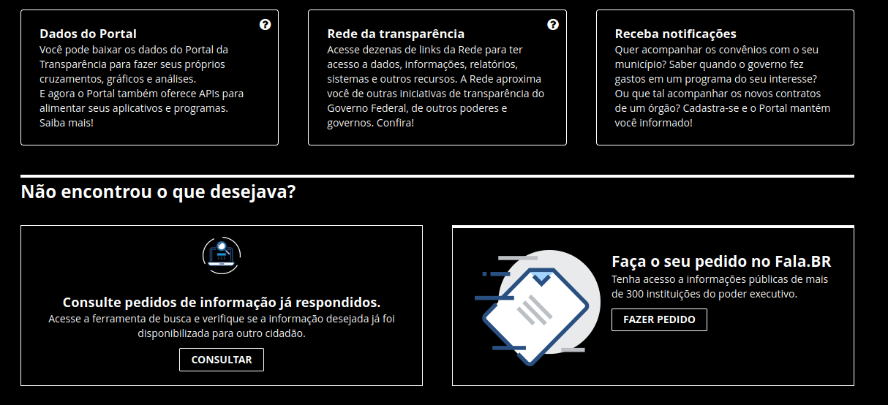
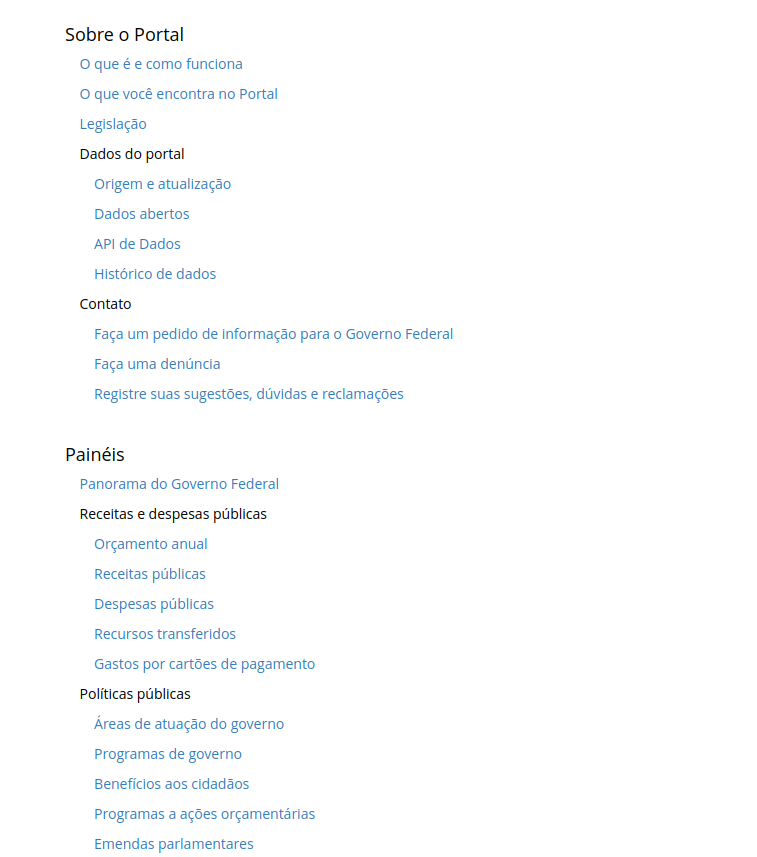

# Alunos

- Maria Eduarda Vieira Monteiro - 221008356
- Felipe de Oliveira Motta - 221031158
- Julia Takaki Neves - 221029249
- Lucas Vieira de Jesus - 211031136
- Davi Gonçalves Akegawa Pierre  - 190105071
- Wolfgang Friedrich Stein - 231032121


# Guia de Acessibilidade Digital

Este é um guia de acessibilidade digital desenvolvido no primeiro semestre de 2024 como parte de um trabalho da disciplina de IHC.
Todo o conteúdo disponível aqui possui instruções de como desenvolver produtos de software que possam ser acessíveis para o público geral.
Dentro desse Guia será analisado os contúdos do site [Portal da Transparência](https://portaldatransparencia.gov.br/).

# Sumário

- [Guia de Acessibilidade Digital](#guia-de-acessibilidade-digital)
- [Sumário](#sumário)
- [Orientações de Acessibilidade](#orientações-de-acessibilidade)
  - [Guia](#guia)
    - [Deficiência Visual](#deficiência-visual)
    - [Deficiência física](#deficiência-física)
    - [Deficiência auditiva](#deficiência-auditiva)
    - [Neurodivergentes](#neurodivergentes)
  - [Análise](#análise)
    - [Deficiência Visual](#deficiência-visual-1)
    - [Deficiência Física](#deficiência-física-1)
    - [Deficiência Auditiva](#deficiência-auditiva-1)
    - [Neurodivergentes](#neurodivergentes-1)
    - [Limitações Relacionadas à Idade](#limitações-relacionadas-à-idade)
- [Padrões de codificação](#padrões-de-codificação)
  - [Utilizar arquivos externos para as Folhas de estilo (CSS) e Javascript](#utilizar-arquivos-externos-para-as-folhas-de-estilo-css-e-javascript)
  - [Limitar as requisições HTTP](#limitar-as-requisições-http)
  - [Evitar o uso de popups](#evitar-o-uso-de-popups)
  - [Utilizar URL's amigáveis](#utilizar-urls-amigáveis)
  - [Header](#header)
    - [Declarar o doctype correto da página](#declarar-o-doctype-correto-da-página)
    - [Declarar o idioma utilizado](#declarar-o-idioma-utilizado)
    - [Colocar um título relevante e presente em todas as páginas](#colocar-um-título-relevante-e-presente-em-todas-as-páginas)
  - [Descrever a codificação de caracteres da página](#descrever-a-codificação-de-caracteres-da-página)
  - [Body (Corpo)](#body-corpo)
    - [Utilize os elementos corretos para a marcação do código.](#utilize-os-elementos-corretos-para-a-marcação-do-código)
    - [Inserir apenas um elemento h1 na página](#inserir-apenas-um-elemento-h1-na-página)
    - [Marcar listas de itens e objetos de forma adequada.](#marcar-listas-de-itens-e-objetos-de-forma-adequada)
    - [Verificar se as tabelas estão sendo utilizadas da forma correta](#verificar-se-as-tabelas-estão-sendo-utilizadas-da-forma-correta)
  - [CSS (Folhas de Estilo)](#css-folhas-de-estilo)
    - [A folha de estilos deve ser externa](#a-folha-de-estilos-deve-ser-externa)
    - [Verificar se a página é compreendida e usável quando o CSS está 'off'](#verificar-se-a-página-é-compreendida-e-usável-quando-o-css-está-off)
- [Testes de Acessibilidade](#testes-de-acessibilidade)
  - [Programa leitores de tela e Navegadores de texto](#programa-leitores-de-tela-e-navegadores-de-texto)
  - [Análise de contraste](#análise-de-contraste)
  - [Visualização em letras grandes](#visualização-em-letras-grandes)

# Orientações de Acessibilidade

## Guia

### Deficiência Visual

Um site projetado para pessoas com deficiência visual deve seguir princípios básicos para compreender as dificuldades que esses usuários podem enfrentar. É essencial ter cuidado com o contraste, pois é extremamente valioso para qualquer pessoa com dificuldade de diferenciar cores, como no caso do daltonismo.

Outro problema a ser considerado é a dificuldade de ver pequenos objetos e letras, como no caso da miopia. Para essas pessoas, é praticamente indispensável uma ferramenta que permita alterar o tamanho da fonte, facilitando a leitura dos textos na página. Além disso, é fundamental incluir legendas e descrições alternativas para as imagens, para que pessoas com dificuldades visuais possam entender o conteúdo apresentado.

### Deficiência física

Um site projetado para pessoas com deficiência física deve levar em consideração várias dificuldades que esses usuários podem enfrentar, como tremores, paralisia e outras limitações de movimento. Para garantir uma experiência acessível e inclusiva, é essencial seguir alguns princípios básicos.

Primeiramente, é importante que o site seja navegável apenas pelo teclado, sem a necessidade de um mouse, pois muitas pessoas com deficiência física podem não conseguir utilizar o mouse devido à falta de controle preciso dos movimentos. Recursos como a navegação por meio de teclas de atalho e a capacidade de tabular entre elementos da página são cruciais para essas pessoas.

Outro aspecto importante é a utilização de botões e links grandes e bem espaçados. Isso facilita a interação para pessoas com controle limitado sobre seus movimentos, reduzindo a possibilidade de erros ao tentar clicar em um pequeno alvo na tela. Adicionalmente, os elementos interativos devem ter descrições claras e intuitivas, permitindo que os usuários compreendam facilmente suas funções.

Por fim, deve-se considerar o uso de tecnologias assistivas, como software de reconhecimento de voz, que permite aos usuários controlarem o site e inserirem informações sem a necessidade de digitação manual. Também é recomendável testar o site com diferentes tipos de dispositivos de entrada, como joysticks especiais e outros equipamentos adaptados, para garantir que todas as funcionalidades estejam acessíveis a pessoas com diversas necessidades físicas.

### Deficiência auditiva

Um site projetado para pessoas com deficiência auditiva deve seguir princípios específicos para atender às necessidades desses usuários, considerando problemas como surdez e baixa audição.

Em primeiro lugar, é essencial garantir que todo o conteúdo multimídia, como vídeos e áudios, tenha legendas de alta qualidade. As legendas devem ser claras, sincronizadas e detalhadas o suficiente para transmitir todas as informações auditivas relevantes, incluindo diálogos, sons de fundo e música. Além disso, a presença de transcrições textuais para conteúdos de áudio proporciona uma alternativa acessível para pessoas que não podem ouvir o áudio.

Notificações e alertas sonoros no site devem ser acompanhados por equivalentes visuais e táteis. Por exemplo, notificações importantes podem ser exibidas como pop-ups visuais ou acompanhadas por vibrações em dispositivos móveis, garantindo que os usuários com deficiência auditiva não percam informações cruciais.

### Neurodivergentes 

Um site projetado para pessoas neurodivergentes deve seguir princípios específicos para atender às necessidades desses usuários, considerando condições como autismo, TDAH, dislexia e outras deficiências intelectuais e psicossociais.

Em primeiro lugar, é essencial que o site tenha uma interface limpa e intuitiva, evitando excesso de informações e elementos distrativos. A simplicidade no design e a organização clara do conteúdo ajudam a reduzir a sobrecarga sensorial e facilitam a navegação para pessoas com dificuldades de atenção e processamento de informações.

O uso de linguagem clara e objetiva é crucial. Textos devem ser escritos de maneira direta, evitando jargões e frases complexas. A utilização de listas, cabeçalhos e parágrafos curtos pode melhorar a legibilidade e a compreensão do conteúdo. Além disso, oferecer alternativas de apresentação, como vídeos explicativos e gráficos, pode ajudar usuários com diferentes estilos de aprendizagem.

Para pessoas com dislexia, é importante fornecer opções de personalização de fonte e espaçamento. Fontes sem serifa e a capacidade de ajustar o tamanho do texto e o espaçamento entre linhas podem melhorar significativamente a legibilidade. Adicionalmente, o uso de cores contrastantes e fundos neutros ajuda a evitar a fadiga visual.

A implementação de funções de navegação simplificada, como menus claros e breadcrumbs (trilhas de navegação), facilita a orientação no site. Para usuários que podem se sentir perdidos facilmente, essas ferramentas proporcionam um caminho claro e lógico para encontrar informações e retornar a seções previamente visitadas.


## Análise

### Deficiência Visual

De modo geral, o site não apresenta uma acessibilidade adequada para deficientes visuais. Observa-se um contraste insuficiente entre o texto e o plano de fundo ([Figura 1](#figura-1)), o que compromete a legibilidade. Embora o site possua um modo de contraste ([Figura 2](#figura-2)), o botão para ativar essa funcionalidade está mal posicionado e, devido à sua falta de contraste, é difícil de ser percebido por daltônicos e por indivíduos com dificuldades em detectar contraste de cores. Além disso, o botão para ativar o modo de contraste está localizado de forma pouco intuitiva, e o texto do botão apresenta um contraste inadequado com a página ([Figura 2](#figura-2)).

<a name="figura-1"></a>

<div style="text-align: center;">


<p align="center">
  <strong>Figura 1:</strong> Falta de contraste do site
</p>
</div>

<a name="figura-2"></a>

<div style="text-align: center;">





<p align="center">
  <strong>Figura 2:</strong> O modo de alto contraste do site
</p>
</div>

O site permite a alteração do tamanho da fonte, o que beneficia pessoas com problemas de visão como miopia, astigmatismo e hipertrofia ([Figura 3](#figura-3))). Entretanto, não há descrições de imagens disponíveis, o que dificulta significativamente a navegação para deficientes visuais ([Figura 4](#figura-4)). Adicionalmente, pessoas cegas enfrentariam ainda mais dificuldades, uma vez que o site não oferece recursos de leitura automática de textos nem navegação por comandos de voz.

<a name="figura-3"></a>

<div style="text-align: center;">


<p align="center">
  <strong>Figura 3:</strong> O porbelma de contraste na página
</p>
</div>

<a name="figura-4"></a>


<div style="text-align: center;">


<p align="center">
  <strong>Figura 4:</strong> A falta de descrição na imagem do site
</p>
</div>

### Deficiência Física

O site apresenta barreiras significativas para pessoas com deficiência física. A navegação exige o uso de links pequenos ([Figura 5](#figura-5)), o que pode ser estressante e desafiador para indivíduos com tremores, movimentos involuntários ou dores que limitam os movimentos. Em casos mais graves, a ausência de uma ferramenta de acesso que não exija a interação com botões torna o site inavegável para pessoas com paralisia, dores severas ou ausência de membros.


<a name="figura-5"></a>

<div style="text-align: center;">




<p align="center">
  <strong>Figura 5:</strong> Links pequenos com navegação difícil para deficiêntes físicos
</p>
</div>


### Deficiência Auditiva

Os vídeos informativos do site pssuem legenda, sendo assim intependente do seu nível de deficiência auditiva você pode usar o site normalmente.

### Neurodivergentes

O site não possui cores agressivas que poderiam assustar ou afastar pessoas neurodivergentes, apresentando um ambiente acolhedor para a maioria das neurodivergências visuais. Além disso, o site não utiliza recursos auditivos ou de fala, evitando problemas relacionados. A interface é fácil de entender, com gráficos coloridos ([Figura 6](#figura-6)) e interativos e vídeos explicativos. O único ponto negativo são as tabelas detalhadas, que podem ser pouco atrativas para pessoas neurodivergentes([Figura 7](#figura-7)).

<a name="figura-6"></a>

<div style="text-align: center;">


<p align="center">
  <strong>Figura 6:</strong> tabela pouco atrativa para neurodivergentes
</p>
</div>


**Figura 7**

<a name="figura-7"></a>

<div style="text-align: center;">


<p align="center">
  <strong>Figura 7:</strong> Tabela atrativa para neurodivergentes
</p>
</div>

### Limitações Relacionadas à Idade

Pessoas idosas podem utilizar o site com relativa facilidade, embora possam enfrentar dificuldades em clicar nos botões caso sofram de deterioração física ([Figura 5](#figura-5)). Outro problema potencial é a cegueira causada por problemas de saúde, o que tornaria a utilização do site praticamente impossível para esses usuários.

# Padrões de codificação

## Utilizar arquivos externos para as Folhas de estilo (CSS) e Javascript

Exemplo:

```html
<link rel="stylesheet" type="text/css" media="screen" href="style.css" />
```

## Limitar as requisições HTTP

Muitas requisições HTTP reduzem o desempenho do navegador

## Evitar o uso de popups

Pop-ups são janelas de diversos tamanhos que abrem com avisos e publicidade. Esse recurso deve ser evitado a todo o custo em sítios governamentais.

Alguns motivos para o não uso de pop-ups:

- Os navegadores mais modernos bloqueiam pop-ups. Sendo assim, se algum informe importante é dado pelo pop-up ele não é visto.
- Pop-ups não são acessíveis. Usuários que usam programas leitores de tela podem se perder, sem saber onde estão ou se realmente entraram no sitio pretendido.
- Alguns pop-ups mais modernos costumam burlar o sistema anti-pop-up dos navegadores carregando na própria página, atrapalhando a leitura do onteúdo.
- Informações importantes devem sempre estar em destaque dentro da página. Na diagramação reserve um espaço para os destaques, que pode ser desativado caso não esteja sendo usado. Nunca use pop-ups para avisos importantes, como recadastro de usuários ou para carregar aplicações ou novas instâncias da página.

## Utilizar URL's amigáveis

Cada página de um sítio deve ser identificada com sua URL única e compreensível.

```
Certo: http://www.portal.gov.br/contato

Errado: http://www.portal.gov.br/default.php?reg=2&p_secao=18
```

## Header

### Declarar o doctype correto da página

Todo documento HTML e XHTML deve declarar o doctype correto para ser considerado válido. O doctype informa ao navegador o tipo de documento que deve ser usado ao carregar a página. É também por meio da declaração de doctype que as ferramentas de validação analisam o código da página e indicam correções.

Existem três tipos:

- Frameset
- Strict
- Transational

### Declarar o idioma utilizado

Exemplo:

```html
<html lang="pt-br">
```

Além de declarar o idioma é possível declarar o país-alvo e a localização da página:

```html
<meta name="country" content="Brazil" />
```

### Colocar um título relevante e presente em todas as páginas

O título de uma página é o enunciado entre as tags "title" "/title" e deve ser um dos elementos obrigatórios do cabeçalho. É importante que o título esteja de acordo com o conteúdo. O título define o rótulo padrão dos favoritos e é a chamada na listagem dos motores de busca. Recomenda-se:

- Evitar expressões redundantes como "bem-vindo ao sítio do ministério x" ou "sítio do ministério x", "página", "homepage", entre outros;
- Não utilize qualquer tipo de slogan no início do título, caso necessário, utilize após o nome do órgão ou projeto separado por hífen. Ex: `<title>`Projeto XYZ - Mais desenvolvimento e cidadania `</title>`;
- Evite o emprego de siglas de instituições ou de seus departamentos, projetos ou programas.
- Utilizar, de preferência, o assunto da página seguido pelo nome do órgão separado por hífen. Ex: `<title>`Contato - Ministério do Planejamento Orçamento e Gestão `</title>`;
- O título deve ter no máximo 60 caracteres;
- Não "polua" o título com palavras-chaves. A inserção de palavras-chaves antes ou após o título principal da página pode confundir os usuários que utilizam leitores de tela. Utilize as tags meta para palavras-chave.

## Descrever a codificação de caracteres da página

Exemplo:

```http
Content-Type: text/html; charset=utf-8
```

## Body (Corpo)

### Utilize os elementos corretos para a marcação do código.

Errado:

```html
<div id="main">
    <p class="titulosec">O subtítulo</p>
</div>
```

Correto:

```html
<div id="main">
    <h2>O subtítulo</h2>
</div>
```

### Inserir apenas um elemento h1 na página

Toda página deve possuir um e apenas um elemento H1. O conteúdo do cabeçalho deve guardar semelhança com o conteúdo do elemento TITLE do cabeçalho.

### Marcar listas de itens e objetos de forma adequada.

Escolher o tipo de lista de acordo com o tipo de item que se deseja inserir. Qual dos tipos abaixos o dado melhor se encaixa?

- Lista ordenada
- Lista não-ordenada
- Lista de definição

### Verificar se as tabelas estão sendo utilizadas da forma correta

Para tornar os dados das tabelas acessíveis é importante utilizar os diversos componentes disponíveis como o cabeçalho `<th>` e o atributo de sumário.

## CSS (Folhas de Estilo)

### A folha de estilos deve ser externa

A folha de estilos (CSS) deve estar sempre em um ou mais arquivos à parte do código, mantendo a separação entre estrutura e apresentação.

### Verificar se a página é compreendida e usável quando o CSS está 'off'

Alguns recursos como o uso de imagens no lugar de texto, ou de menus dinâmicos, podem incorrer na perda de acessibilidade e compreensão quando o CSS é desabilitado. Assegure-se que a página é compreensível e usável com o CSS desabilitado.

# Testes de Acessibilidade

## Programa leitores de tela e Navegadores de texto
Utilizar programas leitores de tela em conjunto com navegadores de texto para testar a página

## Análise de contraste
Verificar se o jogo de cores da página proporciona contraste suficiente para leitura do conteúdo

## Visualização em letras grandes
Verificar o funcionamento da página no caso de alteração do tamanho das letras. Para verificar problemas nesses casos pode-se utilizar o menu de exibição do tamanho de texto no navegador que está sendo utilizado

